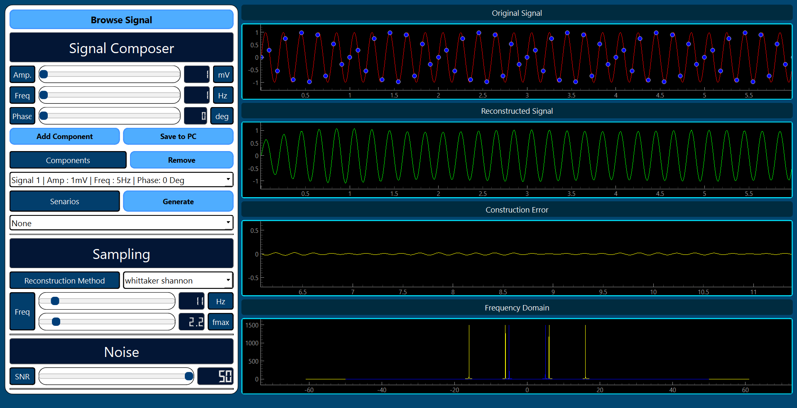
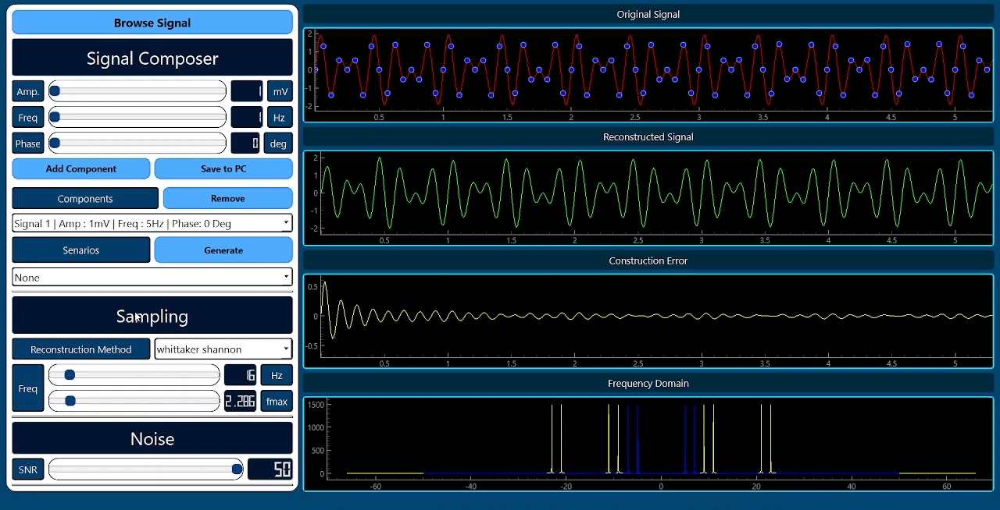
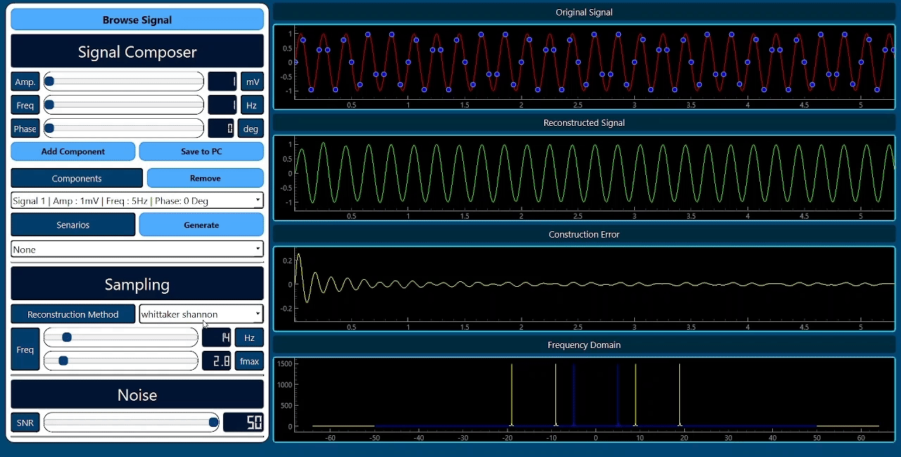

# Signal Sampler



## Description

- Desktop Application Designed To Demonstrate The Principles Of Signal Sampling & Recovery Based On The Nyquist–Shannon Sampling Theorem
- User-Friendly Interface For Easy Visualization Of Different Samping Scenarios
- Provides Additional Reconstruction Methods

## Tech Stack Used

|**Functionality** | |
|--- | --- |
|**UI** | |
|**Styling** | [](#)|

## Features
### 1. Signal Browsing
- Browse A Signal File (Make Sure Its Format & Extension Are The Same As The Files Inside `signals` Directory)

### 2. Signal Mixer
- Sample At Different Frequncies, Showcasing The Difference Between Complete Reconstruction & Aliasing In Real Time


&nbsp;
- Add A Sinusoidal Signal Of Custom Amplitude, Frequency & Phase


&nbsp;
- Remove A Sinusoidal Signal From The Combined Signal
   

### 3. Noise Addition
- Add Noise To The Combined Signal Using Controllable SNR Slider
   

### 4. Different Reconstruction Methods
- Reconstruct The Signal Using Different Methods
   

### 5. Testing Scenarios
- Generate Premade Test Scenarios Having Different Combined Signals
   


## Installation

1. Make Sure That Pip & Python Are Installed On Your System

2. Clone The Repo Onto Your Local System or Download The Zip File & Extract It
   ```bash
    git clone https://github.com/mostafa-aboelmagd/signal-sampling-visualizer.git
    ```

3. Nagivate To The Project's Directory 
   
4. Install The Required Libraries
    ```bash
    pip install -r requirements.txt
    ```

5. Run `MainWindow.py` File
    ```bash
    python MainWindow.py
    ```

## Contributors

| Name | GitHub | LinkedIn |
| ---- | ------ | -------- |
| Mostafa Ayman | [](https://github.com/mostafa-aboelmagd) | [](https://www.linkedin.com/in/mostafa--aboelmagd/) |
| Ali Zayan | [](https://github.com/alizayan684) | [](https://www.linkedin.com/in/%D8%B9%D9%84%D9%8A-%D8%B2%D9%8A%D8%A7%D9%86-%F0%9F%94%BB%F0%9F%87%B5%F0%9F%87%B8-b98239264/) |
| Zeyad Amr | [](https://github.com/Zisco2002)| [](https://www.linkedin.com/in/zeyad-amr-3506b225b/) |
| Mostafa Mousa | [](https://github.com/MostafaMousaaa) | [](https://www.linkedin.com/in/mostafa-mousa-b81b8322a/) |
| Omar Khaled | [](#)| [](https://www.linkedin.com/in/omar-khaled-064b7930a/) |
